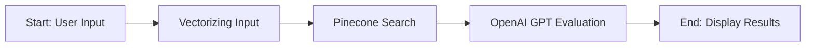

# 🤖 HorizonTwinAI

## Introduction

HorizonTwinAI is an innovative tool designed to assist researchers and grant applicants in identifying similar research projects that have already been funded by the EU under the Horizon program. Utilizing advanced NLP techniques and the power of OpenAI GPT, it provides an efficient and relevant search capability. The goal is to enable users to validate the uniqueness of their research project and gain insights into existing projects within their field of research.

---

## System Workflow
>
> :information_source: **Important Notice:** The CORDIS API, my preferred data source, was unavailable during development, leading to reliance on a dataset last updated on 07.01.2024. This may affect the search results' accuracy and completeness.

---

## Commands

Start API `uvicorn main:app --reload`
